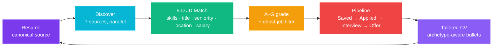

<div align="center">

# Lakshya Hub

### Your AI job-hunt copilot. One workspace. Resume → ATS score → 7-source discover → A–G ranked → Kanban tracked.

<a href="docs/media/lakshya-reel.mp4">
  
</a>

<sub>12-second feature reel · rendered deterministically with <a href="https://github.com/heygen-com/hyperframes">hyperframes</a> · <a href="docs/media/lakshya-reel.mp4">download MP4 (1.1 MB)</a></sub>

[](https://nextjs.org)
[](https://supabase.com)
[](#tests)
[](#what-makes-it-different)
[](LICENSE)
[](#roadmap)

</div>

---

## The 60-second problem

Every job seeker is running the same broken loop:

```
1. Open 5 job boards         (LinkedIn, Naukri, Indeed, Glassdoor, Web)
2. Copy a JD into ChatGPT    "How well does my resume match?"
3. Paste it into a doc       "Let me track this somewhere"
4. Tweak resume              "Need to add their keywords"
5. Apply on yet another tab  Repeat × 50 jobs / week
```

A spreadsheet, a job board, a resume editor, a notes app, an LLM tab — all out of sync. Your resume is the source of truth. Every other tool forgets that.

**Lakshya Hub collapses the loop.** One command scrapes 7 sources, scores each job against your actual resume across 5 dimensions, surfaces the gaps, and lays out a pipeline you can act on. Your resume is the canonical input — every surface reads from it and writes back.

---

## Four pillars



| Pillar | What it does | Where it lives |
|---|---|---|
| **Discover** | Parallel multi-source scrape (LinkedIn, Naukri, Indeed, Glassdoor, Web/ATS APIs), India-filtered, deduplicated, top-50 enriched via Apify RAG | `src/lib/scrapers/`, `src/actions/scrapeJobs.ts` |
| **Resume** | 13 templates · section editing · PDF export · ATS scoring · AI bullet rewriting · PDF/DOCX import with LLM gap-fill | `src/features/resume-builder/`, `src/lib/resumeImport/` |
| **Pipeline** | Kanban (Saved → Applied → Interview → Offer → Rejected) on `@dnd-kit`, every move persisted to Supabase | `src/features/job-board/` |
| **ATS / JD Match** | Rule-based ATS (0–100 + tips) + LLM 5-dimension JD match (skills, title, seniority, location, salary) returning A–G grade, verdict, and gap list | `src/lib/atsEngine.ts`, `src/actions/scrapeJobs.ts` (`runJdMatch5dTask`) — per-job UI panel rebuilding, server-side path live |
| **Voice Calibration** | Anti-AI-detection cover letters: upload your actual writing samples → LLM extracts 8 abstract style descriptors (tone, sentence length, opening, punctuation, vocabulary, structure, voice signatures, avoid-list) → cover-letter generation conditions on your voice instead of GPT-default. PII pre-stripped; only abstract descriptors persisted. | `src/lib/writingStyle/`, `src/app/api/writing-style/`, `/profile/writing-style` UI |
| **Personal-Fit Reranker** *(opt-in via env)* | Deterministic, no-LLM persona pre-filter: hard-disqualifies IT services brands, sorts by archetype/location/comp fit so LLM tokens go to relevant roles. Regional presets (IN/US/EU/GLOBAL) auto-resolve from your profile. | `src/lib/jobsearch/personalFit.ts`, `LAKSHYA_PERSONAL_FIT=true` |

---

## What makes it different

| | Lakshya Hub | Spreadsheet + ChatGPT | LinkedIn alone | Generic ATS optimizers |
|---|---|---|---|---|
| **Single source of truth** (your resume drives every surface) | ✓ | — | — | partial |
| **Multi-source discovery in one query** | ✓ (7 sources) | manual | 1 source | — |
| **5-dimension JD match (not just keyword count)** | ✓ | partial | — | partial |
| **Ghost-job + legitimacy filter** | ✓ | — | — | — |
| **Open source, self-hostable** | ✓ MIT | — | — | rare |
| **BYO AI provider keys (Gemini / Groq / OpenRouter)** | ✓ | — | — | rare |
| **Anti-AI-detection writing-style calibration** | ✓ | — | — | — |

---

## Quick start

```bash
git clone https://github.com/animeshbasak/lakshyaHub.git
cd lakshyaHub
npm install
cp .env.example .env.local   # fill keys: SUPABASE, GEMINI_API_KEY, APIFY_TOKEN
npm run dev                   # → http://localhost:3000
```

**You'll need:**
- Node.js 20+ · npm 10+
- A Supabase project (free tier) — run migrations from `supabase/migrations/`
- At least one AI provider key (Gemini free tier works) — see `docs/SETUP.md`
- Optional: Apify token for premium scrapers; falls back to free Greenhouse / Lever / RemoteOK / Adzuna APIs without it

**Verify:**
```bash
npm test          # 138/138 should pass
npm run build     # type-check + production bundle
```

---

## User journeys

1. **First-time onboarding** — Supabase Auth → `AuthGate` detects missing `resume_profile` → 5-step `OnboardingModal` collects role, target, experience, skills → written to `resume_profiles`.
2. **Import an existing resume** — `/resume` → upload PDF/DOCX → pdfjs/mammoth extracts text → heuristic segmentation → LLM gap-fill via `/api/ai/resume-import-parse` → store hydrated → user reviews low-confidence sections.
3. **Daily job check** — `/discover` → query + location + source toggles → Find Jobs → live scrape log streams from `scrape_logs` → top-50 sorted by fit-score with A–G badges → Save promising ones (upserts `applications` row at status=`saved`).
4. **Apply to a job** — JobDrawer → external apply URL → drag card to "Applied" in `/board` → notes saved via `updateApplicationStatus()`.
5. **Tune resume for a JD** — "Match against my resume" → `/resume?jd_id=…` → 5-dimension breakdown + missing keywords → AI rewrite bullets → ATS panel live-updates → save triggers `syncResumeProfile()` for next scrape. (Per-job match panel in UI is currently feature-flagged off pending the A–G evaluator adapter rebuild — server-side scoring during scrape still runs.)
6. **Track pipeline** — `/board` Kanban → drag-and-drop status → `/dashboard` shows funnel counts, average fit, recent apps.

---

## Surfaces

| Route | Component | Status |
|---|---|---|
| `/dashboard` | Greeting + 4 stat cards + pipeline funnel + recent 5 apps | shipped |
| `/discover` | Query + 7-source toggles + live scrape log + top-50 fit-scored | shipped |
| `/board` | Kanban drag-and-drop + JobDrawer + notes | shipped |
| `/resume` | 13 templates + ATS panel + AI bullet rewrite + PDF export | shipped |
| `/profile` | Settings + AI provider keys + theme tweaks | shipped |
| `/login` | Supabase Auth (magic link + OAuth) | shipped |
| Cmd+K palette | Global navigation | shipped |

---

## Architecture

```
lakshyaHub/
├── src/
│   ├── app/                Next.js 16 App Router (routes + API handlers)
│   ├── actions/            Server actions (scrape, save, sync)
│   ├── features/           Domain modules (resume-builder, job-board)
│   ├── lib/
│   │   ├── scrapers/       7-source scrape orchestrator + per-source adapters
│   │   ├── atsEngine.ts    Rule-based ATS scoring (0–100 + tips)
│   │   ├── filters/        India-relevance + dedup
│   │   └── resumeImport/   PDF/DOCX → structured resume
│   ├── prompts/            LLM prompt templates (5-D match, ghost-job, etc.)
│   └── components/         Shared UI primitives
├── supabase/
│   └── migrations/         SQL schema + RLS (gated by user_id = auth.uid())
├── tests/                  Vitest + integration suites
└── docs/
    ├── PRD.md              Product requirements
    ├── LLD.md              Low-level design
    ├── PROJECT-STATUS.md   Live priority roster + blockers
    └── media/              Reel + screenshots
```

**Stack:** Next.js 16 · React 19 · Supabase (Auth + Postgres + RLS) · `@dnd-kit` · `@react-pdf/renderer` · Apify (premium scrapers) · Gemini / Groq / OpenRouter (BYO keys) · Vitest

---

## Tests

```
290 passing · 1 skipped · 11 todo · 302 total · build clean (Vitest, 28 files)
```

Run locally:
```bash
npm test            # watch mode
npm run test:run    # CI mode
npm run test:ui     # Vitest UI
```

What's covered: resume parser fixtures, ATS engine rules, India filters, dedup, 5-D match scoring, scrape adapters, ghost-job heuristics, personal-fit reranker (43 tests across regional presets + USD/LPA comp parsing), role-fuzzy match (16), liveness checker (20), writing-style PII strip + clause builder + extractor (24).

---

## Roadmap

Tracked in [`docs/PROJECT-STATUS.md`](docs/PROJECT-STATUS.md). Active priorities (user-blocked, infra side):

- **Liveness checker** — needs Vercel mem 3008MB + QStash cron provisioning
- **Sentry integration** — `@sentry/nextjs` install pending approval
- **Stripe webhook** — pending business registration
- **GDPR DSAR endpoint** — needs retention-window decision (90/180/30 day)
- **Playwright a11y runner** — pending `@axe-core/playwright` install

Done in this branch (`feat/careerops-phase-0-1`, 69 commits, [PR #1](https://github.com/animeshbasak/lakshyaHub/pull/1)):
- 7-source discovery (Adzuna added as 7th)
- Persist search across navigation, propagate fit_score to `/board`
- Sort toggle (Best fit / Newest)
- Pre-fit-score every result + full JD inline by default
- Block G ghost-job detection (7-point red-flag screen)
- LaTeX-Article PDF template + sidebar-repeat fix
- S3 LLM rate-limit (6s/user) + S4 daily eval cap (50/day)
- S5 secrets-rotation + S11 incident-response runbooks
- 14 archetype guides + 6 compare pages + STAR stories CRUD
- JSON-LD + dynamic OG + ai-platform guide

---

## Configuration

`.env.local` essentials:

```bash
# Supabase (required)
NEXT_PUBLIC_SUPABASE_URL=https://...
NEXT_PUBLIC_SUPABASE_ANON_KEY=...
SUPABASE_SERVICE_ROLE_KEY=...

# At least one AI provider (Gemini free tier works)
GEMINI_API_KEY=...
# or GROQ_API_KEY / OPENROUTER_API_KEY

# Optional: premium scrapers (falls back to free APIs without)
APIFY_TOKEN=...
```

Full setup: [`docs/SETUP.md`](docs/SETUP.md). User-facing provisioning steps: [`docs/USER-TODO.md`](docs/USER-TODO.md).

---

## Contributing

Solo-maintained today, but PRs are welcome. The work surface is on `feat/careerops-phase-0-1`; merge target is `main` via [PR #1](https://github.com/animeshbasak/lakshyaHub/pull/1).

Conventions:
- Run `npm test && npm run build` before pushing
- Keep tasks vertically sliced (DB → API → UI in one feature, not horizontal layers)
- See [`docs/CHECKLIST.md`](docs/CHECKLIST.md) for the pre-merge checklist

---

## Links

- [PRD](docs/PRD.md) — Product requirements (vision, target user, pillars)
- [LLD](docs/LLD.md) — Low-level design (data flow, services, schemas)
- [Project status](docs/PROJECT-STATUS.md) — Live priority roster + blockers
- [Setup guide](docs/SETUP.md) — Supabase + AI keys + Apify
- [User TODO](docs/USER-TODO.md) — User-side provisioning steps
- [PR #1](https://github.com/animeshbasak/lakshyaHub/pull/1) — feat/careerops-phase-0-1 → main

---

<div align="center">

### Built for the candidate juggling 50 applications a week.

**[Star on GitHub](https://github.com/animeshbasak/lakshyaHub)** · **[Open an issue](https://github.com/animeshbasak/lakshyaHub/issues)** · **[Read the PRD](docs/PRD.md)**

</div>
